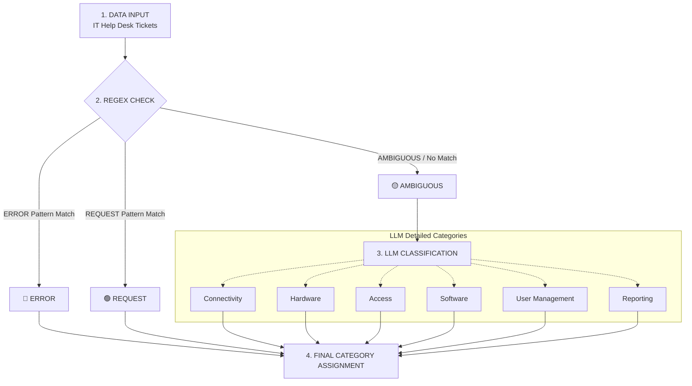

# intelligent-it-help-desk-automation-and-classification

>  This is an educational project developed during my university studies,
> reflecting my hands-on experience.

This project aims to build a pipeline that automatically processes incoming messages to an IT department. The goal is to create a system that classifies requests by routing clear, script-readable information to a rule-based engine (Regex) and sending ambiguous cases to an LLM.

Initially, a classification system that processes messages seems quite straightforward in theory. We define regex rules to match messages based on keywords, and any unmatched messages are passed to an LLM. Simple enough, but during implementation, complications emerge.

## Pre-classification with Regex

A regex function:
```python
def classify_message(text):
    text = text.lower()
    if re.search(error_pattern, text):
        return 'Error'
    elif re.search(request_pattern, text):
        return 'Request'
    else:
        return 'Ambiguous'
```

- For `error_pattern`, I used the keywords: problem, error, not working, issue, and unreachable;
- For `request_pattern`, I used the keywords: request, addition, and installation.

## Hybrid Workflow design

For the workflow visualization, I chose Mermaid due to its simplicity and native GitHub rendering support. The diagram covers four key components: data input, regex processing, routing to the AI model, and final category assignment.

Incoming IT help desk tickets enter the system. Each ticket is processed by a Python regex script that checks for keywords using error_pattern and request_pattern. If no keywords match, the ticket is marked as "Ambiguous". These ambiguous tickets are then sent to an AI model for deeper analysis. The AI model follows a carefully engineered prompt and classifies each ambiguous ticket into one of eleven categories. In the final step, tickets from regex plus tickets from the LLM are combined and stored with their final classification.

Below, the diagram for visual understanding:


```mermaid
graph TD
    A[1. DATA INPUT<br/>IT Help Desk Tickets] --> B{2. REGEX CHECK}
    
    B -->|ERROR Pattern Match| C[🔴 ERROR]
    B -->|REQUEST Pattern Match| D[🟢 REQUEST]
    B -->|AMBIGUOUS / No Match| E[🟡 AMBIGUOUS]
    
    E --> F[3. LLM CLASSIFICATION]
    
    subgraph "LLM Detailed Categories"
    F -.-> F1[Connectivity]
    F -.-> F2[Hardware]
    F -.-> F3[Access]
    F -.-> F4[Software]
    F -.-> F5[User Management]
    F -.-> F6[Reporting]
    end
    
    C --> G[4. FINAL CATEGORY ASSIGNMENT]
    D --> G
    F1 --> G
    F2 --> G
    F3 --> G
    F4 --> G
    F5 --> G
    F6 --> G  
```

## LLM Prompt Engineering

I began by studying the official prompt design strategies documentation from the Gemini API. I had never done prompt engineering before, so here I will describe my experience and the application of basic concepts.

According to the documentation, prompt design is the process of creating prompts or natural language requests that guide a language model to generate accurate and relevant responses.

The first concept I applied is **Clear and specific instructions**. In the documentation, this is described as the most effective way to customize model behavior.

In my designed prompt, this concept is implemented through the following elements:
- Role Prompting: I assigned the model a role — "You are an IT Support specialist". This sets the context and professional tone for the response;
- Closed Vocabulary: The prompt includes a clear list of 6 categories. The model should not invent its own category names but must choose from the provided options;
- Constraints: The sentence "Your job is to categorize the following ticket into ONE of these categories" clearly instructs the model that classification must be unambiguous, without listing multiple options;
- Strict Response Format: The instruction "Return ONLY the category name without any additional text" is a classic example of format constraints, eliminating unnecessary explanations from the model.

### My prompt version
```python
prompt = f"""
You are an IT Support specialist. Your task is to classify the incoming message into ONLY ONE of the categories listed below.
    Categories:
    - Reporting.
    - Connectivity.
    - Hardware.
    - Access.
    - Software.
    - User Management.

Ticket description: {description}

Return ONLY the category name without any additional text.
"""
```

The next important concept in the documentation is the distinction between Zero-shot and Few-shot prompts:
- **Zero-shot** is when the model receives the task without examples;
- **Few-shot** is when the prompt includes several examples of what a correct response looks like. The model identifies patterns from these examples and applies them to new data.

At this stage, I used a Zero-shot prompt. This is necessary to obtain baseline data and compare the "raw" model's performance against the original dataset.

Reference: https://ai.google.dev/gemini-api/docs/prompting-strategies

## Result Analysis

These results clearly show that the current zero-shot prompt needs improvement. The next logical step is to customize the prompt by adding few-shot examples.

## From Zero-Shot to Advanced Instructions

After analyzing the initial results, it became clear that the model struggled. For instance, a user reporting that the HR portal won't load and the screen freezes — was classified as "Connectivity" instead of "Software". This is a reasonable mistake: the message mentions login issues and slowness, which superficially resemble network problems.  

To improve LLM accuracy, the zero-shot prompt was replaced with a few-shot prompt combined with explicit Classification Logic:
* Few-shot examples
* Classification Logic
* Strict output constraints

This approach acts as a decision-making framework for the LLM, explicitly telling it what to ignore and what to prioritize.
